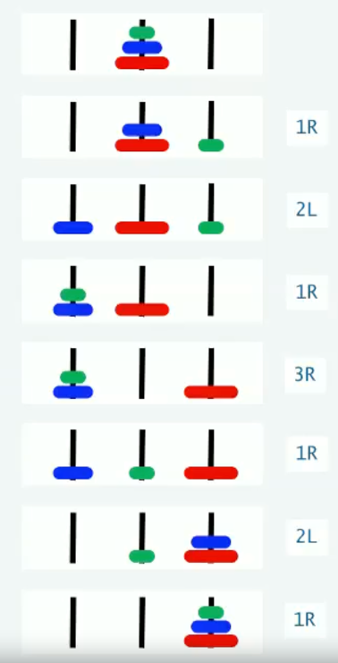

# Assignments of the Coursera algorithms course offered by Princeton University


## Course websites
* [Computer Science: Programming with a Purpose](https://www.coursera.org/learn/cs-programming-java)
* [Algorithms, Part I](https://www.coursera.org/learn/algorithms-part1/)

## Installation
* [Java environment for Mac OS](https://lift.cs.princeton.edu/java/mac/)

## Algorithms, Part I

### Module 1 Hello, World
* [Assignment instructions](https://coursera.cs.princeton.edu/algs4/assignments/hello/specification.php)
* [Solutions](src/part1/module1_course_intro)
* Commands for testing the program

```
cd src/part1/module1_course_intro
javac-algs4 RandomWord.java
java-algs4 RandomWord < animals8.txt
```

### Module 2 Percolation
* [Assignment instructions](https://coursera.cs.princeton.edu/algs4/assignments/percolation/specification.php)
* [Solutions](src/part1/module2_union_find)
* Commands for testing the program

```
cd src/part1/module2_union_find
javac-algs4 Percolation.java
java-algs4 Percolation 10

javac-algs4 PercolationStats.java
java-algs4 PercolationStats 200 100
```

### Module 4 Stacks and Queues
* [Linked list implementation of stack](src/part1/module4_stacks_queues/LinkedStackOfStrings.java)
* [Array implementation of stack](src/part1/module4_stacks_queues/FixedCapacityStackOfStrings.java)
* [Resizing array implementation of stack](src/part1/module4_stacks_queues/ResizingArrayStackOfStrings.java)
* [Linked list implementation of queue](src/part1/module4_stacks_queues/LinkedQueueOfStrings.java)
* [Generics implementation of stack](src/part1/module4_stacks_queues/Stack.java)
* [Iterator implementation of bag](src/part1/module4_stacks_queues/Bag.java)
* [Iterator implementation of deque](src/part1/module4_stacks_queues/Deque.java)
* [Resizing array implementation of randomized queue](src/part1/module4_stacks_queues/RandomizedQueue.java)

* [Assignment instructions](https://coursera.cs.princeton.edu/algs4/assignments/queues/specification.php)
* Commands for testing [the client program](src/part1/module4_stacks_queues/Permutation.java)

```
javac-algs4 Permutation.java

java Permutation 3 < distinct.txt
java Permutation 8 < duplicates.txt
```

## Computer Science: Programming with a Purpose

### Module 1 Basic Programming Concepts
* [Assignment instructions](https://coursera.cs.princeton.edu/introcs/assignments/hello/specification.php)
* [Solutions](src/cs-programming-java/module1_basic_programming_concepts/assignment)

### Module 2 Conditionals and Loops
* [Assignment instructions](https://coursera.cs.princeton.edu/introcs/assignments/loops/specification.php)
* [Solutions](src/cs-programming-java/module2_conditionals_and_loops/assignment)

### Module 3 Arrays
* [Assignment instructions](https://coursera.cs.princeton.edu/introcs/assignments/arrays/specification.php)
* [Solutions](src/cs-programming-java/module3_arrays/assignment)

### Module 4 Input and Output
* [Fractal drawing example](src/cs-programming-java/module4_input_and_output/lecture/Chaos.java)
* [Animation example](src/cs-programming-java/module4_input_and_output/lecture/BouncingBall.java)
* [Assignment instructions](https://coursera.cs.princeton.edu/introcs/assignments/io/specification.php)
* [Solutions](src/cs-programming-java/module4_input_and_output/assignment)

### Module 5 Functions and Libraries
* [Assignment instructions](https://coursera.cs.princeton.edu/introcs/assignments/functions/specification.php)
* [Solutions](src/cs-programming-java/module5_functions_and_libraries/assignment)

### Module 6 Recursion
* [Hanoi example](src/cs-programming-java/module6_recursion/lecture/Hanoi.java)



* [Assignment instructions](https://coursera.cs.princeton.edu/introcs/assignments/recursion/specification.php)
* [Solutions](src/cs-programming-java/module6_recursion/assignment)

### Module 7 Performance
* [Assignment instructions](https://coursera.cs.princeton.edu/introcs/assignments/performance/specification.php)
* [Solutions](src/cs-programming-java/module7_performance/assignment)

### Module 8 Abstract Data Types
* [Assignment instructions](https://coursera.cs.princeton.edu/introcs/assignments/oop1/specification.php)
* [Solutions](src/cs-programming-java/module8_abstract_data_types/assignment)

### Module 9 Creating Data Types
* [Assignment instructions](https://coursera.cs.princeton.edu/introcs/assignments/oop2/specification.php)
* [Solutions](src/cs-programming-java/module9_create_data_types/assignment)